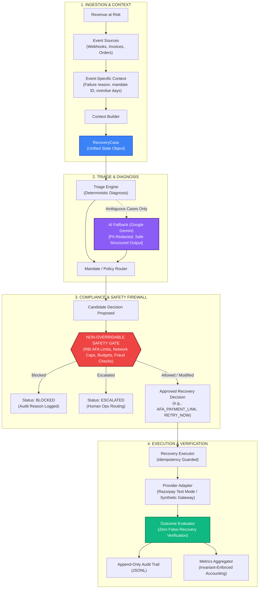
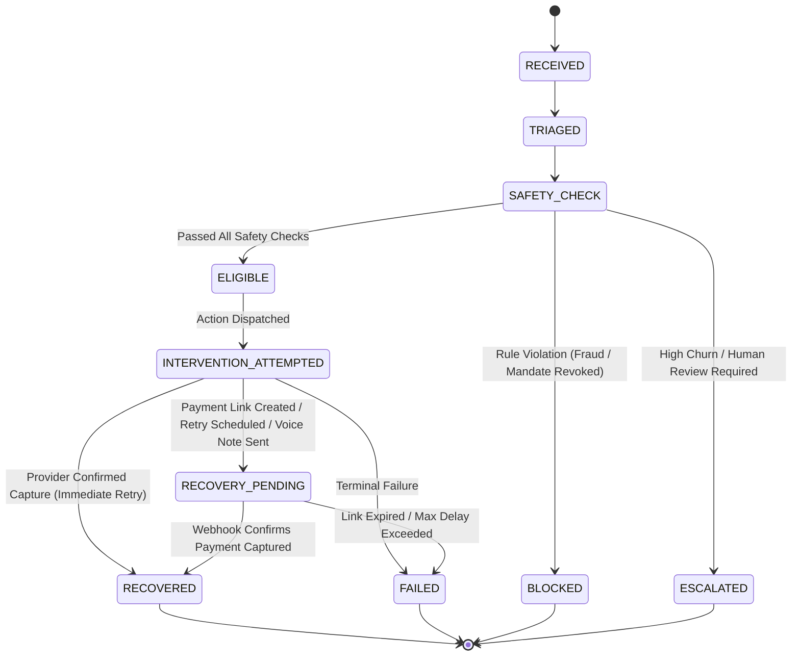

# CHAKRA — Autonomous Revenue Recovery Engine

[](https://www.python.org/)
[](https://fastapi.tiangolo.com/)
[](https://react.dev/)
[](LICENSE)
[](metrics_report.json)
[-brightgreen.svg)](eval_report.json)

> **Enterprise-grade Autonomous Revenue Recovery Infrastructure for India's Fintech & Recurring Payments Ecosystem.**

---

## 🎯 Executive Summary

Chakra is an autonomous revenue recovery engine built specifically for recurring Indian payment flows, subscription mandates, invoices, and checkout drop-offs. Unlike legacy dunning software that retries transactions blindly on naive timers—causing customer harassment, bank card blacklisting, and regulatory non-compliance—Chakra operates as an **intelligent, safety-gated decision pipeline**.

### Core Product Principle

$$\begin{matrix}
\textbf{AI PROPOSES} \\
\Downarrow \\
\textbf{POLICY DECIDES} \\
\Downarrow \\
\textbf{EXECUTOR ACTS} \\
\Downarrow \\
\textbf{PROVIDER CONFIRMS} \\
\Downarrow \\
\textbf{CHAKRA MEASURES}
\end{matrix}$$

1. **AI Proposes:** LLMs (Google Gemini) analyze ambiguous failure codes without ever having direct authority to execute.
2. **Policy Decides:** The Non-Overridable Safety Gate deterministically enforces RBI e-mandate rules, network retry caps, and intervention budgets.
3. **Executor Acts:** Approved actions (retries, payment links, voice notes, reminders) are dispatched with strict idempotency.
4. **Provider Confirms:** Money is **never** assumed to be recovered when a link is created or a retry scheduled. Only provider-verified capture registers as `RECOVERED`.
5. **Chakra Measures:** Mathematical invariants ensure that revenue recovered never exceeds revenue attempted, and every rupee is traceable via tamper-proof audit trails.

---

## 🏛️ System Architecture

Chakra strictly processes events through an 11-stage auditable conceptual pipeline:



### Conceptual Architecture Stages

1. **Revenue at Risk:** The raw loss potential detected across payment attempts, overdue invoices, and dropped checkouts.
2. **Event Sources:** Real-time webhooks from gateways (Razorpay, mock providers), subscription billing events, and invoice feeds.
3. **Context Builder:** A single unified builder that ingests event-specific context (failure reason, payment method, overdue days, mandate ID, retry counts) and normalizes it into a consistent format.
4. **RecoveryCase:** The authoritative domain model encapsulating customer state, transaction amount, current lifecycle state, and risk flags.
5. **Triage Engine:** Evaluates failure codes with sub-millisecond deterministic rules. Classifies issues into transient failures, hard declines, customer friction, or compliance blocks.
6. **AI Fallback (Google Gemini):** Triggered **only** when triage encounters ambiguous, unrecognized error codes or multi-cause failures. PII is redacted prior to inference, and the LLM produces strictly typed structured decisions (`reason`, `confidence`, `recommended_action`). Chain-of-thought is never logged or exposed.
7. **Mandate / Policy Router:** Evaluates case type, mandate status, and customer history to formulate a candidate `RecoveryDecision`.
8. **Non-Overridable Safety Gate:** The central policy enforcer. Evaluates candidate actions against mandatory regulatory rules (RBI e-mandate directives, Visa/Mastercard retry caps, monthly intervention limits, fraud indicators). Can permit, override, or outright block any action.
9. **Recovery Actions:** Concrete interventions: `RETRY_NOW`, `RETRY_LATER`, `PAYMENT_LINK`, `AFA_PAYMENT_LINK`, `VOICE_RECOVERY`, `REMINDER`, `ESCALATE`, or `BLOCK`.
10. **Recovery Executor:** Dispatches approved actions against payment providers using cryptographic idempotency keys.
11. **Outcome Evaluator:** Validates real provider feedback. Translates provider HTTP/webhook signals into verified outcomes without assuming success.
12. **Audit Trail + Metrics:** Records structured audit events in append-only JSONL files and aggregates mathematical metrics verified by rigorous invariants.

---

## 🛡️ The Non-Overridable Safety Gate

The Safety Gate is the most critical component in Chakra. While machine learning and heuristic models propose candidate actions, the Safety Gate has **sole, non-overridable authority** to reject or modify actions.

### 6 Enforced Safety Rules

| Rule Name | Trigger Condition | Enforcement Action | Regulatory / Business Rationale |
|---|---|---|---|
| **Hard Revocation Check** | `mandate_state == REVOKED` | **BLOCK** | Debiting a revoked mandate violates RBI circulars and incurs high bank penalty fees. |
| **Fraud & Risk Block** | `fraud_flag == True` or high-risk signal | **BLOCK** | Immediate stop to prevent chargebacks and merchant account suspension. |
| **Network Retry Caps** | Exceeded network retry limit (e.g. Visa 4 retries / 16 days, Mastercard 10 / 30 days) | **BLOCK** | Violating card scheme rules results in severe non-compliance fines. |
| **Intervention Budget** | Customer has received $\ge N$ interventions in the current calendar month | **BLOCK / ESCALATE** | Prevents dunning spam, brand erosion, and customer harassment. |
| **Idempotency Guard** | Duplicate event received on the same day for the same transaction | **BLOCK** | Guarantees zero double-debit incidents under race conditions or duplicate webhooks. |
| **RBI AFA Enforcement** | Transaction amount $\ge ₹15,000$ (or first transaction on mandate) | **CONVERT TO AFA_PAYMENT_LINK** | Reserve Bank of India mandate requires Additional Factor of Authentication (OTP/3DS) for high-value transactions. |

> [!IMPORTANT]
> **Safety Guarantee:** No LLM recommendation or routing policy can ever bypass the Safety Gate. If an LLM recommends `RETRY_NOW` on an account with a revoked mandate, the Safety Gate intercepts and deterministically sets the status to `BLOCKED`.

---

## 🔄 Recovery Lifecycle & Zero False-Recovery Guarantee

Every `RecoveryCase` in Chakra traverses an explicit, observable lifecycle:



### The Zero False-Recovery Guarantee

In amateur recovery systems, generating an SMS payment link or deferring a retry is prematurely counted as "recovered revenue". **Chakra strictly rejects this practice.**

- **Payment Link Created?** Status: `RECOVERY_PENDING`. Revenue Recovered: **₹0**.
- **Voice Note Generated?** Status: `RECOVERY_PENDING`. Revenue Recovered: **₹0**.
- **Retry Scheduled for +24 Hours?** Status: `RECOVERY_PENDING`. Revenue Recovered: **₹0**.
- **Only Provider-Confirmed Success:** Revenue is credited to `revenue_recovered_inr` **only** when the provider returns `status == "captured"` or `outcome == "success"`.

---

## ⚡ Intervention Types Matrix

Chakra exposes 8 discrete intervention mechanisms tailored to recovery scenarios:

| Intervention | Typical Trigger | Mechanism | Observable State |
|---|---|---|---|
| `RETRY_NOW` | Transient network error / bank gateway timeout under retry caps | Immediate synchronous retry request to payment provider | `RECOVERED` or `FAILED` |
| `RETRY_LATER` | Insufficient funds on active mandate | Schedules execution after a designated delay (e.g. 24h/48h aligned with salary cycles) | `RECOVERY_PENDING` |
| `PAYMENT_LINK` | Expired card, soft decline, or checkout abandonment | Generates a secure, branded alternative payment link with custom expiry | `RECOVERY_PENDING` |
| `AFA_PAYMENT_LINK` | Amount $\ge ₹15,000$ or first mandate transaction | Generates an OTP/3DS-mandated payment link satisfying RBI e-mandate guidelines | `RECOVERY_PENDING` |
| `VOICE_RECOVERY` | High-value subscription overdue by 7+ days | Generates a contextual Hinglish conversational voice note and dispatches link | `RECOVERY_PENDING` |
| `REMINDER` | B2B receivable nearing due date or promise-to-pay window | Issues non-intrusive payment reminder artifact | `RECOVERY_PENDING` |
| `ESCALATE` | Multiple pre-debit alerts ignored (churn risk) or agent uncertainty | Routes directly to human operations desk with annotated triage context | `ESCALATED` |
| `BLOCK` | Revoked mandate, confirmed fraud flag, or network cap reached | Halts all automated recovery attempts immediately | `BLOCKED` |

---

## 🖥️ Chakra Command Center (Frontend)

The Chakra Command Center is a purpose-built, high-density operations console designed with a **dark financial infrastructure aesthetic** (not a generic SaaS template).

### Overview of Pages & Screens

1. **Page 1: Overview**
   - **Financial Recovery Funnel:** Real-time visual pipeline from *Revenue At Risk* $\rightarrow$ *Revenue Attempted* $\rightarrow$ *Revenue Recovered*.
   - **Headline Metrics Cards:** Revenue At Risk (₹), Revenue Attempted (₹), Revenue Recovered (₹), Recovery Rate (%), Payments Recovered, Blocked, Escalated, and Pending counts.
   - **Intervention Breakdown Table:** Complete real-time audit showing attempted, succeeded, failed, and pending figures per intervention.
   - **Case Type Breakdown Table:** Performance partitioned across Payment Failures, Subscriptions, Checkout Abandonment, Receivables, and Promise-to-Pay.
   - **Synthetic Benchmark Label:** Benchmark figures are explicitly labeled: *"Synthetic 120-case benchmark — not production Razorpay data."*

2. **Page 2: Live Recovery Feed**
   - Real-time operational card feed reflecting incoming cases.
   - Visual status badges:
     - `✓` **RECOVERED** (Green)
     - `◷` **RECOVERY_PENDING** (Yellow)
     - `🛡` **BLOCKED** (Red)
     - `↗` **ESCALATED** (Orange)
   - One-click navigation to inspect any case in the Decision Explorer.

3. **Page 3: Decision Explorer / Case Detail (Primary Inspection Screen)**
   - Complete 8-stage interactive visual breakdown:
     - **EVENT:** Sanitized raw payload, amount, case ID, timestamp.
     - **CONTEXT:** Customer profile, mandate state, failure history, risk indicators.
     - **TRIAGE:** Classification category, confidence score (%), recommended action.
     - **AI FALLBACK:** Transparent disclosure of Gemini LLM involvement. If not required, clearly displays *"Deterministic policy path — AI fallback not required."* (Chain-of-thought is never rendered).
     - **MANDATE ROUTER:** Candidate policy applied and proposed action.
     - **SAFETY GATE:** Visually prominent check list (Mandate Active, Retry Cap, Budget, Fraud, Idempotency, AFA Threshold). Highlights `ALLOWED`, `AFA REQUIRED`, or `BLOCKED`.
     - **EXECUTOR:** Dispatched action, provider target, and idempotency status.
     - **OUTCOME:** Verified provider response and recovered revenue amount.

4. **Page 4: Safety Center**
   - Dedicated regulatory control room showing live protection policies.
   - Interactive visual exhibit:
     $$\text{AI PROPOSED: RETRY\_NOW} \longrightarrow \text{SAFETY GATE: MANDATE REVOKED} \longrightarrow \textbf{BLOCKED}$$
   - Recent safety decisions audit log with rule triggers and reason codes.

5. **Page 5: Audit Trail**
   - Chronological event stream with structured JSON inspector for all pipeline stages.
   - PII-redacted payloads conforming to privacy standards.

6. **Page 6: Live Demo / Event Simulator**
   - Controlled simulation panel to trigger synthetic revenue-at-risk events.
   - Configurable parameters: Case Type, Amount (₹), Failure Reason, Mandate State (`ACTIVE` / `REVOKED`), Churn Risk, and Fraud Risk.
   - Calls the **real backend pipeline** via `POST /api/demo/simulate` (zero mock engines in the UI).
   - Animates the journey live from ingestion to final outcome.

7. **Page 7: System Architecture Panel**
   - Live architectural visualization detailing the full 11-stage pipeline.

---

## 🎬 Demo Scenarios Walkthrough

The following 4 scenarios demonstrate Chakra's core capabilities in live presentations:

### Scenario 1 — Successful Transient Recovery
- **Input:** Amount: `₹2,499` | Case Type: `PAYMENT_FAILURE` | Reason: `insufficient_funds` | Mandate: `ACTIVE`
- **Triage:** Diagnosed as transient failure (confidence 98%).
- **Safety Gate:** Mandate verified active, retry cap available $\rightarrow$ **ALLOWED**.
- **Action:** `RETRY_NOW` dispatched.
- **Provider Result:** `captured`.
- **Final State:** `RECOVERED` | Revenue Recovered: **₹2,499**.

### Scenario 2 — Intelligent Subscription Routing & Non-False Recovery
- **Input:** Amount: `₹8,999` | Case Type: `SUBSCRIPTION` | Overdue: `7 days` | Mandate: `ACTIVE`
- **Router:** Selected `VOICE_RECOVERY` for multi-day overdue subscription.
- **Safety Gate:** Verified $\rightarrow$ **ALLOWED**.
- **Action:** Contextual Hinglish voice recovery note and payment link generated.
- **Final State:** `RECOVERY_PENDING` | Revenue Recovered: **₹0** *(Correctly uncredited until customer pays)*.

### Scenario 3 — Non-Overridable Safety Block (Compliance & Fraud)
- **Input:** Amount: `₹25,000` | Case Type: `PAYMENT_FAILURE` | Mandate: `REVOKED`
- **Triage / Router:** May propose recovery action.
- **Safety Gate:** Intercepts revoked mandate $\rightarrow$ **HARD BLOCK**.
- **Action:** Blocked. No provider debit attempted.
- **Final State:** `BLOCKED` | Reason: `MANDATE_REVOKED_NO_RETRY`.

### Scenario 4 — RBI Additional Factor of Authentication (AFA) Enforcement
- **Input:** Amount: `₹22,000` | Case Type: `PAYMENT_FAILURE` | Mandate: `ACTIVE`
- **Router:** Proposes `RETRY_NOW`.
- **Safety Gate:** Detects amount $\ge ₹15,000$ limit $\rightarrow$ **OVERRIDE**.
- **Final Action:** Converts to `AFA_PAYMENT_LINK`.
- **Final State:** `RECOVERY_PENDING` with compliant OTP link.

---

## 📊 Benchmark & Evaluation Report

Chakra includes a rigorous benchmarking suite and invariant verification harness:

### 120-Case Synthetic Mixed Benchmark (`metrics_report.json`)

| Metric | Benchmark Result |
|---|---|
| **Total Cases Processed** | 120 |
| **Revenue At Risk** | ₹3,560,390.86 |
| **Revenue Attempted** | ₹2,299,207.07 |
| **Revenue Recovered** | ₹1,950,019.64 |
| **Revenue Recovery Rate** | **54.77%** |
| **Interventions Attempted** | 67 |
| **Interventions Succeeded** | 52 |
| **Intervention Success Rate** | **77.61%** |
| **Payments Blocked by Safety Gate** | 13 (10.83%) |
| **Payments Escalated to Ops** | 36 (30.00%) |

### Mathematical Invariant Guarantees

Every benchmark execution programmatically validates three core invariants:
1. **Revenue Hierarchy:** $\text{Revenue Recovered} \le \text{Revenue Attempted} \le \text{Revenue At Risk}$
2. **Count Hierarchy:** $\text{Payments Recovered} \le \text{Interventions Succeeded} \le \text{Interventions Attempted} \le \text{Payments Processed}$
3. **Partition Sum:** $\text{Payments Blocked} + \text{Payments Escalated} + \text{Payments Eligible} == \text{Payments Processed}$

$$\textbf{Invariant Status: ALL PASSED (100\%)}$$

### 18-Case Safety & Policy Evaluation (`eval_report.json`)

Chakra is evaluated against an adversarial benchmark of 18 edge cases testing compliance rules:
- Standard insufficient funds retry
- AFA threshold exceedance (> ₹15,000)
- First mandate transaction AFA requirement
- Fraud flag hard compliance block
- Revoked mandate hard compliance block
- Pre-debit alert churn escalation
- Network retry caps (Visa / Mastercard)
- High-value category limits (> ₹100,000)
- Expired card alternative links
- Monthly customer intervention budget caps

$$\textbf{Evaluation Score: 18 / 18 (100.0\% Accuracy)}$$

---

## 🔌 API Reference

| Method | Endpoint | Description |
|---|---|---|
| `GET` | `/health` | System health check (database, Razorpay mode, Twilio, Gemini status) |
| `GET` | `/api/metrics` | Returns full metrics report including `by_intervention` and invariant validations |
| `GET` | `/api/audit` | Retrieves newest audit events from the append-only audit trail (`?limit=100`) |
| `GET` | `/api/policy` | Public, non-secret recovery and regulatory policies for safety visualization |
| `GET` | `/api/cases` | Lists active recovery cases from the database aggregate |
| `GET` | `/api/cases/{id}/trace` | Returns complete, structured decision journey for a case (without CoT) |
| `POST` | `/api/demo/simulate` | Triggers a synthetic recovery case through the **real** 6-stage backend pipeline |
| `POST` | `/api/payments/orders` | Generates a Razorpay Test Mode or Synthetic checkout order |
| `POST` | `/api/payments/verify` | Server-side signature verification for Razorpay checkout success |
| `POST` | `/api/payments/abandon` | Handles checkout abandonment drop-off and triggers recovery workflow |
| `POST` | `/api/payments/{id}/retry` | Requests a provider-managed retry attempt |
| `POST` | `/webhooks/razorpay` | Ingests real or synthetic Razorpay webhook events with HMAC verification |

---

## 🚀 Quickstart & Setup Guide

### Prerequisites
- Python 3.11+
- Node.js 18+ (optional, if running frontend via npm)
- Git

### 1. Clone & Environment Setup
```bash
git clone https://github.com/RudraMalvankar/Chakra.git
cd Chakra

# Create virtual environment
python -m venv .venv

# Activate virtual environment
# On Windows:
.venv\Scripts\activate
# On Linux/macOS:
source .venv/bin/activate

# Install dependencies
pip install -r requirements.txt
```

### 2. Environment Configuration
Copy `.env.example` to `.env`:
```bash
cp .env.example .env
```
Key configuration parameters:
- `USE_MOCK_RAZORPAY=true`: Runs Chakra with the built-in local synthetic payment gateway (default).
- `RAZORPAY_KEY_ID` & `RAZORPAY_KEY_SECRET`: (Optional) Connects Chakra to actual Razorpay Test Mode.
- `GEMINI_API_KEY`: (Optional) Enables Google Gemini fallback for ambiguous failures.

---

### 3. Running Chakra

#### Option A: One-Click Demo Mode (Terminal 1 & Terminal 2)

**Terminal 1 — Backend Recovery Engine:**
```bash
python -m uvicorn backend.app.main:app --host 0.0.0.0 --port 8000 --reload
```

**Terminal 2 — Command Center Frontend:**
```bash
cd frontend
python -m http.server 3000
```
Open **[http://localhost:3000](http://localhost:3000)** in your browser to access the Chakra Command Center.

---

#### Option B: Full Stack with Synthetic Razorpay Gateway

If testing mock gateway webhooks locally:

**Terminal 1 — Synthetic Gateway:**
```bash
python -m uvicorn mock-razorpay.main:app --host 0.0.0.0 --port 8001
```

**Terminal 2 — Backend Engine:**
```bash
python -m uvicorn backend.app.main:app --host 0.0.0.0 --port 8000 --reload
```

**Terminal 3 — Frontend Command Center:**
```bash
cd frontend
python -m http.server 3000
```

---

### 4. Running the Benchmark & Verification Harness

Execute the 120-case recovery benchmark:
```bash
python backend/scripts/run_demo.py
```
This processes 120 mixed cases, evaluates the 18-case safety suite, checks all mathematical invariants, and outputs `metrics_report.json` and `eval_report.json`.

---

## 🧪 Testing & Code Quality

Run the complete regression and unit test suite:
```bash
python -m pytest -q backend/tests
```
Verify complete Python compilation syntax:
```bash
python -m compileall -q backend mock-razorpay
```

---

## 📂 Project Structure

```text
Chakra/
├── backend/
│   ├── app/
│   │   ├── api/                   # FastAPI route handlers
│   │   │   ├── webhooks.py        # Webhook ingestion & signature validation
│   │   │   ├── receivables.py     # B2B invoice recovery endpoints
│   │   │   ├── escalations.py     # Ops review & manual escalation handling
│   │   │   └── voice.py           # Conversational voice recovery routes
│   │   ├── config.py              # Central Pydantic settings & env management
│   │   ├── db/                    # SQLAlchemy database sessions & migrations
│   │   ├── lib/                   # Utilities, audit logger (JSONL), policy configs
│   │   ├── models/                # Domain models (RecoveryCase, PaymentState, etc.)
│   │   ├── schemas/               # Request & response validation schemas
│   │   └── services/              # Core business logic services
│   │       ├── context_builder.py # Normalizes raw events to RecoveryCase
│   │       ├── triage.py          # Deterministic triage engine
│   │       ├── llm.py             # Google Gemini fallback service (PII redacted)
│   │       ├── mandate_router.py  # Policy & mandate routing orchestrator
│   │       ├── safety_gate.py     # Non-overridable compliance & safety firewall
│   │       ├── recovery_executor.py# Action execution dispatcher
│   │       ├── outcome_evaluator.py# Provider response verification
│   │       ├── metrics_aggregator.py# Invariant-checked metrics aggregation
│   │       └── razorpay_client.py # Provider adapter (Test mode + synthetic)
│   ├── scripts/                   # CLI runners (run_demo.py, print_metrics.py)
│   └── tests/                     # 160+ automated unit and integration tests
├── frontend/                      # Chakra Command Center
│   ├── index.html                 # Single-page application entrypoint
│   └── app.jsx                    # React 18 dashboard with dark financial UI
├── mock-razorpay/                 # Standalone synthetic payment gateway
│   ├── main.py                    # Mock API endpoints (payments, orders, links)
│   └── seed.py                    # Deterministic 120-case benchmark generator
├── docs/                          # Architecture & design documentation
├── audit_log.jsonl                # Append-only structured runtime audit trail
├── metrics_report.json            # Generated summary metrics & invariant verification
├── eval_report.json               # Generated 18-case safety accuracy report
└── requirements.txt               # Backend Python dependencies
```

---

## 🚀 Deployment Guide

### Option B: Deploying Frontend on Vercel + Backend on Render

#### 1. Backend Web Service on Render
1. Open [Render Dashboard](https://dashboard.render.com/) → **New +** → **Web Service** → Connect your GitHub repository.
2. Configure the build parameters:
   - **Name:** `chakra-backend`
   - **Environment:** `Python 3`
   - **Region:** Choose closest to your database (e.g. `Oregon` or `Frankfurt`)
   - **Root Directory:** `.`
   - **Build Command:** `pip install -r requirements.txt`
   - **Start Command:** `python -m uvicorn backend.app.main:app --host 0.0.0.0 --port $PORT`
   - **Health Check Path:** `/health`
3. Add Environment Variables in Render:
   - `DATABASE_URL`: Your Neon Postgres connection string (e.g., `postgresql://...`)
   - `GEMINI_API_KEY`: Your Google Gemini API key
   - `CORS_ORIGINS`: `*`
   - `DRY_RUN`: `false`
   - `USE_MOCK_RAZORPAY`: `true` (or `false` when connecting live Razorpay test keys)
   - `RAZORPAY_KEY_ID`: *(Optional)* Your Razorpay test key
   - `RAZORPAY_KEY_SECRET`: *(Optional)* Your Razorpay test secret
4. Click **Deploy Web Service**. Once live, copy your backend URL (e.g. `https://chakra-backend.onrender.com`).

*(Alternatively, use the included [`render.yaml`](render.yaml) Blueprint for 1-click infrastructure deployment).*

#### 2. Frontend on Vercel
1. Open [Vercel](https://vercel.com/) → **Add New Project** → Import your Chakra repository.
2. Configure project settings:
   - **Framework Preset:** `Vite`
   - **Root Directory:** Click **Edit** and select `frontend`
   - **Build Command:** `npm run build`
   - **Output Directory:** `dist`
3. Add Environment Variable:
   - `VITE_API_BASE_URL`: Your Render backend URL (e.g., `https://chakra-backend.onrender.com`)
4. Click **Deploy**.
   - The included [`frontend/vercel.json`](frontend/vercel.json) handles client-side SPA routing rewrites automatically, ensuring sub-routes (`/cases`, `/gateway`, `/escalations`, `/voice`) work directly on refresh.

---

### Option C: Running with Docker Locally or on a Server

Chakra is fully containerized with production-grade Dockerfiles and a unified Compose configuration.

#### 1. Quickstart with Docker Compose
```bash
# Clone and enter directory
git clone https://github.com/RudraMalvankar/Chakra.git
cd Chakra

# (Optional) Copy and configure environment variables
cp .env.example .env

# Build and start all services in the background
docker compose up -d --build
```

- **Backend API & Docs:** [http://localhost:8001](http://localhost:8001) / [http://localhost:8001/docs](http://localhost:8001/docs)
- **Frontend Dashboard:** [http://localhost:5173](http://localhost:5173)
- **Health Check:** [http://localhost:8001/health](http://localhost:8001/health)

#### 2. Pre-Built GitHub Container Packages (GHCR)
The GitHub Actions CI/CD workflow automatically builds and publishes container packages on every push to `main` or release:

```bash
# Pull backend image
docker pull ghcr.io/rudramalvankar/chakra/chakra-backend:latest

# Pull frontend image
docker pull ghcr.io/rudramalvankar/chakra/chakra-frontend:latest
```

---

## ⚖️ License & Ethical Disclosure

- **Software License:** Apache 2.0.
- **Benchmark Disclosure:** All benchmarks provided in `metrics_report.json` and demonstrated in the Command Center are derived from a **synthetic 120-case deterministic seed**. They demonstrate architectural correctness and recovery logic; they are **not** production Razorpay transaction records.
- **Financial Simulation Notice:** When operated in default mode, Chakra connects to the internal `mock-razorpay` gateway and does not process real monetary transactions.

---

## 👤 Author

**Made by [Rudra Malvankar](https://github.com/RudraMalvankar)**

© 2026 Rudra Malvankar. All rights to the code remain with the author.
