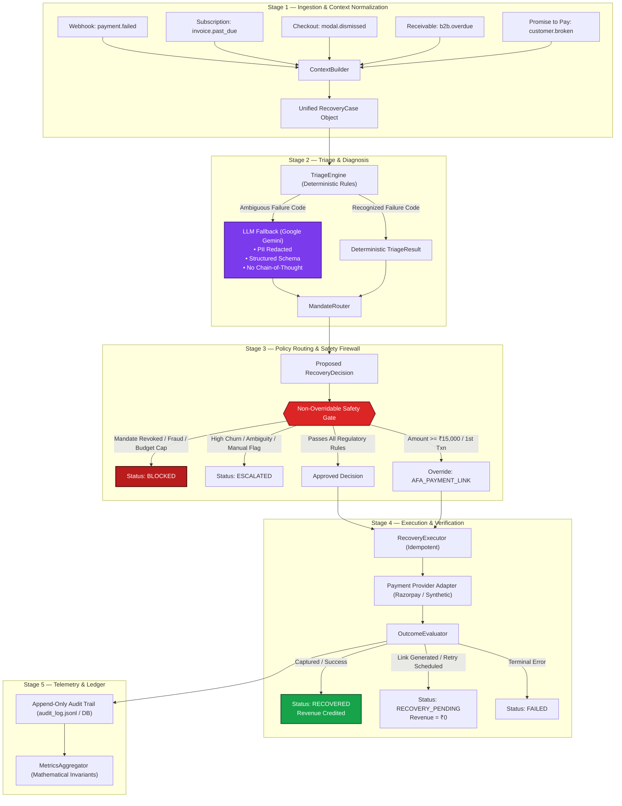

# Chakra System Architecture Specification

## 1. Executive Architectural Overview

**Chakra** is an autonomous revenue recovery engine designed for the Indian fintech and recurring payments ecosystem. It operates as an intelligent decision orchestration pipeline situated between incoming revenue-at-risk triggers (payment failures, overdue subscriptions, checkout drop-offs, unpaid invoices) and execution channels (payment gateways, automated retries, payment links, and conversational voice recovery).

The core tenet of the architecture is strict separation of powers:
```
AI PROPOSES  ──▶  POLICY DECIDES  ──▶  EXECUTOR ACTS  ──▶  PROVIDER CONFIRMS  ──▶  CHAKRA MEASURES
```

1. **AI Proposes:** Diagnostic components (heuristics + Google Gemini fallback) diagnose failure ambiguity and formulate recommendations without execution privileges.
2. **Policy Decides:** A deterministic, non-overridable **Safety Gate** validates candidate actions against regulatory directives (RBI circulars), card network rules, and merchant risk policies.
3. **Executor Acts:** Approved actions are dispatched through idempotency-protected provider adapters.
4. **Provider Confirms:** Money is only counted as recovered when confirmed captured by the payment provider.
5. **Chakra Measures:** Invariant-checked metrics aggregation ensures verifiable financial accounting.

---

## 2. End-to-End Conceptual Flow



---

## 3. Deep-Dive Component Architecture

### 3.1 Ingestion & Context Normalization (`ContextBuilder`)
The system accepts heterogeneous revenue-at-risk payloads across five distinct workflows:
- **Payment Failures:** Webhook payloads containing bank error codes (`BAD_REQUEST_PAYMENT_TIMED_OUT`, `GATEWAY_ERROR`, `PAYMENT_AUTHENTICATION_FAILED`).
- **Subscription Invoices:** Auto-debit retry failures, dunning day counts (`days_overdue`), and billing cycle intervals.
- **Checkout Abandonments:** Client-side order dismissals with order identifiers, shopping basket amounts, and customer contact handles.
- **B2B Receivables:** Commercial invoices exceeding payment credit terms (30/60/90 days overdue).
- **Promise-to-Pay:** Customer-stipulated payment commitment dates that have elapsed without payment capture.

`ContextBuilder` normalizes all payloads into an authoritative `RecoveryCase` domain model:
```python
class RecoveryCase(BaseModel):
    case_id: str
    case_type: CaseType # PAYMENT_FAILURE, SUBSCRIPTION, CHECKOUT_ABANDONMENT, RECEIVABLE, PROMISE_TO_PAY
    customer_id: str
    amount_at_risk: float
    currency: str = "INR"
    status: PaymentState
    failure_reason: str
    context: Dict[str, Any]
    metadata: Dict[str, Any]
    retry_count: int = 0
    alerts_ignored: int = 0
    fraud_flag: bool = False
```

### 3.2 Triage Engine (`TriageEngine` & `LLMFallback`)
- **Deterministic Triage:** High-throughput dictionary matching against known payment gateway error codes. Evaluates network codes (e.g. Visa `05`, `51`, `65`) and Razorpay internal error strings.
- **Ambiguity Detection:** If an error code is unknown, multi-faceted, or carries low heuristic confidence (< 0.85), it is marked `is_ambiguous = True`.
- **Google Gemini Fallback:**
  - Invoked strictly when `is_ambiguous == True`.
  - **PII Stripping:** Customer names, card numbers, email prefixes, and IP addresses are scrubbed before prompt construction.
  - **Constrained Output:** Enforces strict Pydantic JSON schema output (`classification`, `confidence`, `reason`, `recommended_action`).
  - **Zero Chain-of-Thought Leakage:** Prompt instructions forbid raw internal reasoning in user-visible or audit fields.
  - **Network Resilience:** If Gemini API is unreachable or times out, the system defaults to safe operational escalation (`ESCALATE`).

### 3.3 Mandate / Policy Router (`MandateRouter`)
Maps the diagnosed triage result and historical context to an operational recovery candidate:
- **Subscriptions Overdue > 5 Days:** Routes to conversational `VOICE_RECOVERY` or `PAYMENT_LINK`.
- **Soft Declines on Active Mandates:** Routes to delayed retry (`RETRY_LATER`) scheduled around user liquidity patterns.
- **Card Expiry:** Routes to mandate card update link (`PAYMENT_LINK`).
- **High Pre-Debit Alerts Ignored (≥ 3):** Routes to churn-prevention alert or human operations escalation (`ESCALATE`).

### 3.4 Non-Overridable Safety Gate (`SafetyGate`)
A stateless policy firewall sitting in front of execution. It evaluates candidate decisions against strict compliance, risk, and fraud invariants:
1. **Mandate State Check:** Mandate status of `REVOKED` or `PAUSED` immediately causes a `HARD_COMPLIANCE_BLOCK`.
2. **Fraud Prevention:** Any `fraud_flag == True` terminates processing with `HARD_COMPLIANCE_BLOCK`.
3. **Card Scheme Caps:** Checks cumulative retries against Visa rules (max 4 attempts / 16 days) and Mastercard rules (max 10 attempts / 30 days).
4. **Intervention Budget:** Restricts automated dunning touches per customer per month (merchant configurable, default 4).
5. **Idempotency Check:** Rejects duplicate events for the same payment within the active cooling-off window.
6. **RBI AFA Regulatory Gate:** Transactions exceeding the Reserve Bank of India's e-mandate limit without Additional Factor of Authentication (standard ₹15,000 / special ₹100,000 for mutual funds/insurance) are modified to `AFA_PAYMENT_LINK`.

### 3.5 Recovery Executor (`RecoveryExecutor`)
Dispatches approved actions:
- **`RETRY_NOW`:** Dispatches immediate capture attempt to provider.
- **`RETRY_LATER`:** Registers deferred execution timer; updates state to `RECOVERY_PENDING`.
- **`PAYMENT_LINK` / `AFA_PAYMENT_LINK`:** Calls provider API to create branded short-URL payment link; sets status to `RECOVERY_PENDING`.
- **`VOICE_RECOVERY`:** Synthesizes customized Hinglish voice reminder audio file incorporating customer name, overdue invoice amount, and dynamic payment link; dispatches via Twilio or local TTS; sets status to `RECOVERY_PENDING`.
- **`ESCALATE`:** Posts ticket to operations dashboard; sets status to `ESCALATED`.
- **`BLOCK`:** Logs compliance block reason; sets status to `BLOCKED`.

### 3.6 Outcome Evaluator (`OutcomeEvaluator`)
Enforces the **Zero False-Recovery Guarantee**:
- Evaluates provider responses (`status == 'captured'` or `outcome == 'success'`).
- Translates outcomes strictly to `RECOVERED` or `FAILED`.
- Unrecovered interventions (links, deferred retries) remain `RECOVERY_PENDING` with **₹0 revenue recovered credited**.

---

## 4. Concurrency & Idempotency Architecture

To prevent race conditions, duplicate debits, and double-crediting across distributed webhook deliveries:
1. **Cryptographic Idempotency Keys:** Every dispatched retry or payment link generation creates an idempotency hash:
   $$\text{IdempotencyKey} = \text{SHA256}(\text{payment\_id} + \text{action} + \text{date\_string})$$
2. **File-Lock Retry Strategy:** In file-based storage modes (`audit_log.jsonl`), an exponential backoff file-lock retry prevents concurrent write corruption under heavy Windows/Linux I/O contention.
3. **Transactional Database Aggregation:** In database mode, unique constraints on `payment_id` and atomic updates prevent double processing.

---

## 5. Security, Privacy & PII Scrubbing

- **PII Scrubbing:** Before any case is dispatched to external LLMs, customer identifiers are redacted via `PIIRedactor`:
  - Phone numbers $\rightarrow$ Masked (`+91-XXXXX-1234`)
  - Email addresses $\rightarrow$ Tokenized (`c***@domain.com`)
  - Customer names $\rightarrow$ Generic surrogate tokens (`Customer_8921`)
  - Card PANs $\rightarrow$ Redacted per PCI-DSS standards
- **Zero Raw Chain-of-Thought:** Internal LLM reasoning is stripped before serializing audit events to logs, APIs, or user interfaces.
