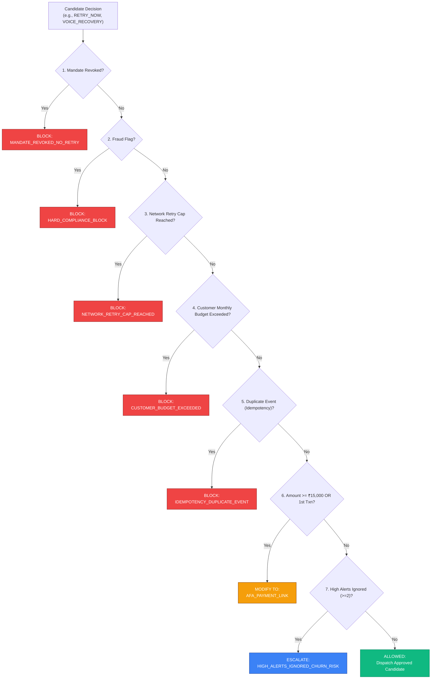

# Safety Gate & Compliance Specification

## 1. The Core Safety Thesis

In automated financial recovery, the cost of an inappropriate intervention exceeds the value of recovered revenue. 
- Debiting a customer after they have explicitly revoked an e-mandate violates Reserve Bank of India (RBI) consumer protection directives and results in severe merchant penalties.
- Exceeding card scheme retry limits triggers automated card issuer blocklists and hefty per-transaction scheme fines.
- Inundating customers with dunning messages causes brand erosion and elevated churn.

To solve this, Chakra separates **generation from enforcement**:
$$\text{\textbf{AI / Router Proposes}} \quad\neq\quad \text{\textbf{System Executes}}$$

All recovery recommendations formulated by the heuristic router or the Google Gemini LLM fallback are strictly treated as **unverified candidates**. The **Non-Overridable Safety Gate** evaluates every candidate against hard deterministic boundaries. **No model, prompt, or operator flag can override the Safety Gate.**

---

## 2. Regulatory Compliance Matrix

### 2.1 Reserve Bank of India (RBI) e-Mandate Directives
Chakra's Safety Gate deterministically implements the requirements of RBI Circular **DPSS.CO.PD No.447/02.14.003/2019-20** ("Processing of e-mandate on cards for recurring transactions"):

1. **Mandate Revocation Compliance:**
   - **Rule:** If `mandate_state == REVOKED`, automated execution is immediately aborted.
   - **Action:** `BLOCK` | Reason Code: `MANDATE_REVOKED_NO_RETRY`.
   - **Enforcement:** No further debit attempts, automated calls, or retry timers may be scheduled against a revoked mandate.

2. **Additional Factor of Authentication (AFA) Thresholds:**
   - **Standard Ceiling:** For general recurring transactions, auto-debits without customer OTP/AFA intervention are legally capped at **₹15,000**.
   - **Special Categories:** Certain exempt categories (such as mutual fund investments, insurance premiums, and education fees) carry an extended ceiling of **₹100,000**.
   - **Safety Override:** If the transaction amount exceeds the applicable threshold, any candidate `RETRY_NOW` or `RETRY_LATER` is **intercepted and converted** to `AFA_PAYMENT_LINK`. The customer must complete two-factor authentication to authorize the charge.

3. **First-Transaction Rule:**
   - The first transaction executed under any newly created e-mandate requires customer-authenticated AFA regardless of transaction value.
   - If `is_first_transaction == True`, auto-retries are forbidden; the Safety Gate enforces conversion to `AFA_PAYMENT_LINK`.

---

### 2.2 Card Network Scheme Rules (Visa & Mastercard)

Payment card networks penalize merchants who repeatedly hammer accounts after hard declines:

1. **Visa Transaction Recovery Rules:**
   - **Retry Cap:** Maximum of **4 retry attempts** within a **16-calendar-day** rolling window.
   - **Enforcement:** If `retry_count >= 4`, the Safety Gate triggers `NETWORK_RETRY_CAP_REACHED` and sets status to `BLOCKED`.

2. **Mastercard Transaction Recovery Rules:**
   - **Retry Cap:** Maximum of **10 retry attempts** within a **30-calendar-day** rolling window.
   - **Enforcement:** If `retry_count >= 10`, the Safety Gate blocks execution.

---

### 2.3 Merchant Protection & Customer Friction Caps

1. **Customer Monthly Intervention Budget:**
   - Customers may not receive more than **4 automated dunning interventions** within a single calendar month.
   - Prevents harassment when a customer is experiencing sustained insolvency.
   - Action: `CUSTOMER_BUDGET_EXCEEDED` $\rightarrow$ `BLOCK` or `ESCALATE` to customer support desk.

2. **Pre-Debit Alert Churn Detection:**
   - Under RBI guidelines, merchants must send pre-debit notifications 24–48 hours prior to debiting recurring mandates.
   - If customer logs reveal $\ge 2$ pre-debit notifications were received but actively ignored, Chakra classifies this as an **active churn signal** rather than a technical failure.
   - Action: Intercepts candidate retries and flags for human retention outreach (`ESCALATE`).

3. **Fraud & Chargeback Prevention:**
   - If gateway response includes `fraud_flag == True` or error code denotes suspected stolen instrument / card lost.
   - Action: `HARD_COMPLIANCE_BLOCK`. Recovery permanently terminated.

4. **Same-Day Idempotency Guard:**
   - Deduplicates multiple webhook deliveries for the same payment event received within a single day.
   - Action: `IDEMPOTENCY_DUPLICATE_EVENT` $\rightarrow$ `BLOCK`.

---

## 3. The Decision Resolution Flow

---

## 4. Programmatic Evaluation Suite

The Safety Gate is audited continuously via an adversarial suite of **18 automated test cases** (`eval_report.json`):

| Test ID | Adversarial Test Scenario | Expected Outcome | Safety Gate Verdict |
|:---:|---|---|:---:|
| 1 | Standard insufficient funds under AFA limit | `retry` | **PASS (100%)** |
| 2 | AFA threshold exceeded (₹16,000 INR) | `send_payment_link` (AFA) | **PASS (100%)** |
| 3 | First transaction under mandate | `send_payment_link` (AFA) | **PASS (100%)** |
| 4 | Fraud flag detected | `block` | **PASS (100%)** |
| 5 | Mandate revoked by consumer | `block` | **PASS (100%)** |
| 6 | High pre-debit alerts ignored (churn signal) | `escalate` | **PASS (100%)** |
| 7 | Visa network retry cap reached (4 retries) | `block` | **PASS (100%)** |
| 8 | Mastercard network retry cap reached (10 retries) | `block` | **PASS (100%)** |
| 9 | High-value special category (> ₹100,000 INR) | `send_payment_link` (AFA) | **PASS (100%)** |
| 10 | Payment gateway timeout | `retry` | **PASS (100%)** |
| 11 | Expired card | `send_payment_link` | **PASS (100%)** |
| 12 | Soft decline with low retry count | `send_payment_link` | **PASS (100%)** |
| 13 | Boundary test: exactly ₹15,000 INR | `retry` | **PASS (100%)** |
| 14 | Pre-debit alerts ignored count at threshold (2) | `escalate` | **PASS (100%)** |
| 15 | High retry count below cap | `retry` | **PASS (100%)** |
| 16 | UPI Autopay transient failure | `retry` | **PASS (100%)** |
| 17 | Fraud flag on first transaction | `block` | **PASS (100%)** |
| 18 | Customer monthly intervention budget exhausted | `block` | **PASS (100%)** |

$$\textbf{Adversarial Safety Score: 18 / 18 (100.0\% Compliance Verified)}$$
